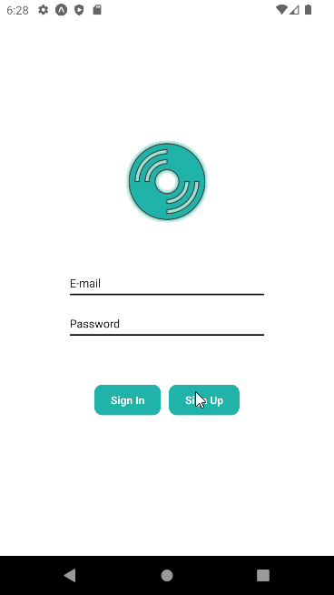

[](https://classroom.github.com/online_ide?assignment_repo_id=8443880&assignment_repo_type=AssignmentRepo)

# MUSIC APP 

## ABOUT PROJECT
In this project, a music app is designed using React Native Expo CLI. The navigation of the pages is provided with "React Navigation". The project makes use of the song lists data on Napster Database API. Firebase is used to post, reset user and login logout processes. Existing user information is saved in the phone's memory using async storage. Redux saves the data that is used across all app pages, such as the user, theme and liked songs. When the app is restarted, the user is not presented with the login page thanks to Async storage.  MaterialCommunityIcons was used to create the bottom tab icons. 



## INSTALLATION

Clone the project and run the commands below respectively in the terminal.
```
git clone https://github.com/patika-218-akbank-reactnative-bootcamp/assignment-5-Atakanz.git
```

```
cd MusicApp
```
```
expo start
```

## TECHNICALITIES

 A nested form of stack and bottom navigation is made at the beginning of the project. The user is first presented with the sign-in page and login form before moving on to the sign-up button. With firebase, user information is posted to a server. The user is saved to Redux - user slice management after being found, and the page is then navigated automaticly to the other conditional stack from which is bottom tab. On the home page, two list api are displayed, one of which allows users to create touch-sensitive playlist cards and navigate to tracklists. The new album releases are listed by the other API. Every tracklist consists of unique component units that manage like or unlike process. The second tab's genre list cards are used to access track lists. The search page's top also has a search text field. Favorite songs are listed in the third tab.
 All app pages can handle like or unlike processes.The only information that can currently be changed on the edit profile page is the email. This issue will be resolved in later versions. 